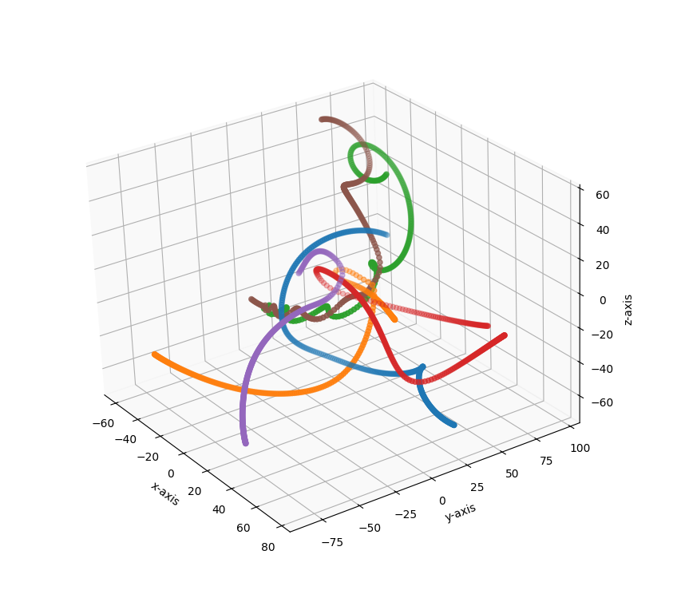

# Python Gravity Simulation
> A 3D n-body gravity simulation written in Python.



## Usage
To get started, install all of the relevant packages with:
```
pip install -r requirements.txt
```
Next, just `cd` to the project's root directory and run:
```
py -m src.main [seed_string]
```
To change the settings for the simulation, such as:
- the number of particles
- the number and size of the timesteps
- the maximum masses, distances, and speeds of the randomly-generated particles
- the number of points displayed in the final plot
- and more...

just check out and edit the contents of the `config.yaml` file in found in `/.config/` 

## How it works
1. Config values are read from `config.yaml` that dictate how random particles are generated.
2. These values are used to generate `Particle` objects that store information about each particle's state
3. Gravity calculations are performed on a list of particles per timestep, while checks for collisions take place
4. If collisions are found, collision groups are identified and 'merged' with the largest particle, with their momenta being conserved.
5. Particle positions are read at a config-value derived rate and stored in position logs.
6. These particle positions are parsed and plotted in 3D using pyplot.

## Navigating
```
📦final-project
 ┣ 📂.config
 ┃ ┗ config.yaml
 ┣ 📂docs
 ┃ ┗ Gravity_Simulation.png
 ┣ 📂src
 ┃ ┣ 📂classes
 ┃ ┃ ┣ config.py
 ┃ ┃ ┗ particle.py
 ┃ ┣ __init__.py
 ┃ ┣ data_types.py
 ┃ ┣ permutations.py
 ┃ ┣ particle_setup.py
 ┃ ┣ motion_calcs.py
 ┃ ┣ collision_handler.py
 ┃ ┣ energy.py
 ┃ ┣ plotter.py
 ┃ ┗ main.py
 ┣ .gitignore
 ┣ requirements.txt
 ┗ README.md
 ```

## What now?
Thanks for reading! If you want to read a little bit more about the thought behind the code, check out `docs/deep-dive.md`.

Enjoy messing around with it! - `Callum`


